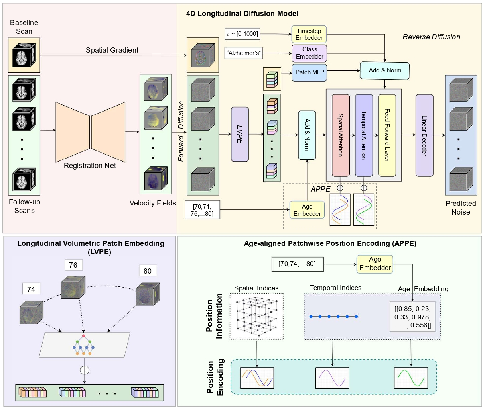

# Generative Modeling of Neurodegenerative Brain Anatomy with 4D Longitudinal Diffusion Model

This folder contains the code files for the work "Generative Modeling of Neurodegenerative Brain Anatomy With 4D Longitudinal Diffusion Model."

## Abstract
Understanding and predicting the progression of neurodegenerative diseases remains a major challenge in medical AI, with significant implications for early diagnosis, disease monitoring, and treatment planning. However, most available longitudinal neuroimaging datasets are temporally sparse with a few follow-up scans per subject. This scarcity of temporal data limits our ability to model and accurately capture the continuous anatomical changes related to disease progression in individual subjects. To address this problem, we propose a novel 4D (3D$\times$T) diffusion-based generative framework that effectively models and synthesizes longitudinal brain anatomy over time, conditioned on available clinical variables such as health status, age, sex, and other relevant factors. Moreover, while most current approaches focus on manipulating image intensity or texture, our method explicitly learns the data distribution of topology-preserving spatiotemporal deformations to effectively capture the geometric changes of brain structures over time. This design enables the realistic generation of future anatomical states and the reconstruction of anatomically consistent disease trajectories, providing a more faithful representation of longitudinal brain changes. We validate our model through both synthetic sequence generation and downstream longitudinal disease classification, as well as brain segmentation. Experiments on two large-scale longitudinal neuroimage datasets demonstrate that our method outperforms state-of-the-art baselines in generating anatomically accurate, temporally consistent, and clinically meaningful brain trajectories.

## Requirements
        torch==2.7.1+cu126
        numpy==1.24.4
        pandas==2.0.3
        scipy==1.11.2

## Training 

1. Registration Net: Run the following command to obtain a pre-trained registration network:

        python reg_train_ae.py

2. Longitudinal Diffusion Model Training: Run the following command to train the deformation version of our longitudinal diffusion transformer (~2 GPU). Note that the same model can be used for the intensity framewokr by replacing the registration net with a VAE.

        torchrun --nproc_per_node=2 --nnodes=1 --node_rank=0 --master_addr="127.0.0.1" --master_port=29500 train_dvit.py

        OR

        python -m torch.distributed.run --nproc_per_node=2 --nnodes=1 --node_rank=0 --master_addr=127.0.0.1 --master_port=29500 train_dvit.py

## Sampling

For sampling from the trained diffusion model using PC Sampling, use the following command:
       
        python pc_sampling.py

The scripts required to deform the initial scan using the sampled deformations have been incorporated in the same file.

Note: All parameters must be configured within their designated files. Scripts supporting user-level command-line arguments will be publicly released upon acceptance.
